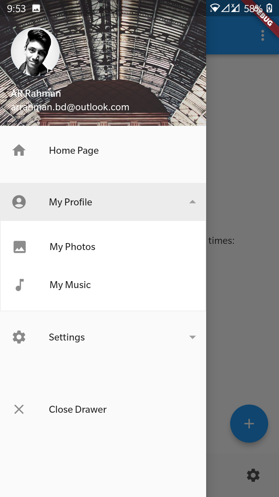
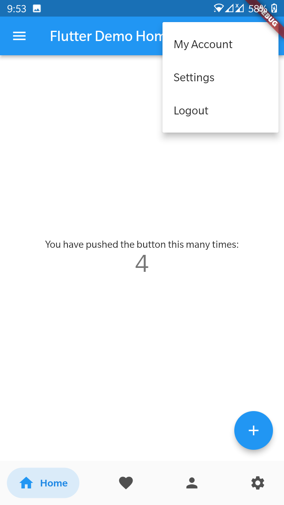

# Flutter Material UI counter Expanded
Easy template with Expandable App Menu and Popup Action Menu with Bottom Tab Bar.

## Installation
After cloning this repository, Run the following commands:
```bash
  flutter pub add accordion
```
```bash
  flutter pub add bottom_bar
```

## Drawer



## Home


## 🔗 Links
[](https://www.linkedin.com/arrahmanbd)